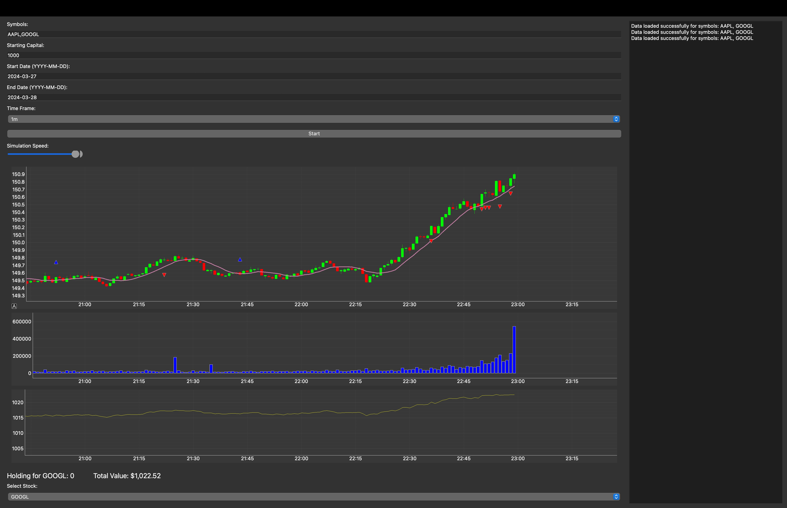

# Stock Trading Simulator

Python-based application that simulates stock trading. It uses historical data to test the performance of trades over time.

## Features

- Fetch and utilize historical stock data.
- Visualize stock price movements and trading outcomes.
- GUI for easy interaction and simulation control.

## Dashboard

## Libraries used

- PyQt5 for the GUI
- Pandas for data handling
- Matplotlib and mplfinance for visualization
- yfinance for data acquisition
